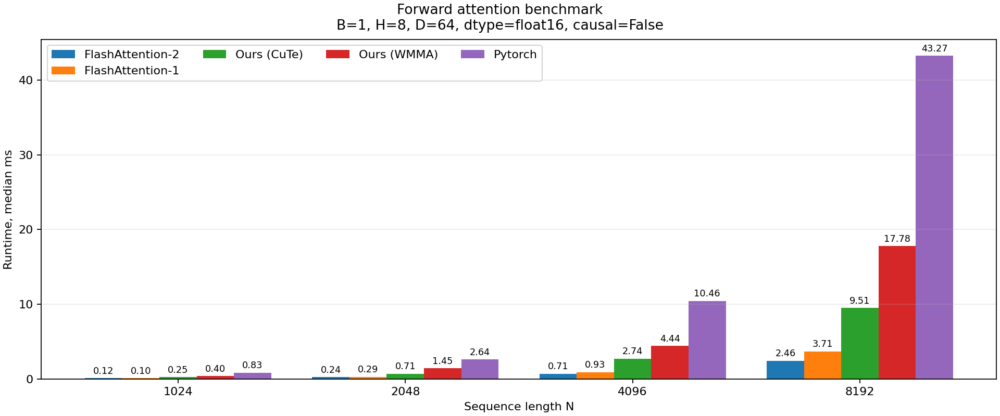
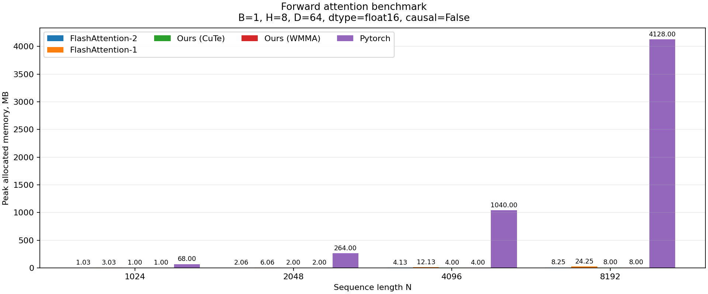

# mini-flash-attention

A small, readable FlashAttention-style forward pass implemented in CUDA C++.

On an RTX A4000, the CuTe kernel is **up to 4.5x faster** than a naive PyTorch attention implementation and it does not allocate extra global workspace: it never materializes the full $N \times N$ attention matrix.

The point of this repo is not to beat the official `flash-attn` kernels. The point is to show that the core FlashAttention idea can be implemented in a compact, readable way: **~150 lines for the WMMA kernel** and around **~250 lines for the CuTe/CUTLASS kernel**.

## What is inside

There are two CUDA kernels worth reading:

- [`src/mini_flash_attention/flash_attn_wmma_cuda.cu`](src/mini_flash_attention/flash_attn_wmma_cuda.cu)

  A simple CUDA C++ / WMMA version. It uses Tensor Cores for `Q @ K^T`, runs blockwise online softmax, and keeps the output accumulator small. `P @ V` is still done in a simpler scalar style, so this file is a good first step if you want to understand the algorithm.

- [`src/mini_flash_attention/flash_attn_cuda.cu`](src/mini_flash_attention/flash_attn_cuda.cu)

  A faster CuTe/CUTLASS version. It uses CuTe register tensors, Tensor Core MMA for both `Q @ K^T` and `P @ V`, register-resident intermediate values, and swizzled shared-memory layouts to reduce bank conflicts.

Current scope:

- forward pass only;
- fp16;
- $D = 64$;
- non-causal attention;
- input layout $[B \cdot H, N, D]$.

## Why this is interesting

The naive PyTorch implementation is simple:

```python
scores = q @ k.transpose(-1, -2)
p = softmax(scores)
out = p @ v
```

But it materializes the full $N \times N$ score/probability matrix, so memory grows like $O(N^2)$.

This project implements the FlashAttention idea directly in CUDA:

1. split `Q`, `K`, and `V` into blocks;
2. compute `Q @ K^T` block by block;
3. update softmax online;
4. accumulate `P @ V` into the output;
5. never store the full attention matrix.

For the forward kernel itself, the extra workspace is constant with respect to sequence length, there is no extra $O(N^2)$ attention buffer.

## Kernel sketch

The faster CuTe kernel uses this rough structure:

```text
one CTA = one Q block and one batch/head item
one warp = 16 query rows

load Q tile once into shared memory

for each K/V tile:
    load K and V into shared memory
    accS = Q @ K^T              # Tensor Cores, fp32 registers
    online softmax over accS
    accO *= alpha               # row-wise rescale in registers
    accO += P @ V               # Tensor Cores, fp32 registers

normalize accO by softmax denominator
store output
```

The implementation stays compact, but still includes real performance tricks:

- blockwise online softmax;
- Tensor Cores via WMMA / CuTe MMA;
- fp16 inputs with fp32 accumulation;
- register-resident accumulators;
- swizzled shared-memory layouts;
- no full $N \times N$ score/probability matrix.

## Benchmark

Benchmarked on an **NVIDIA RTX A4000**, with:

```text
B=1, H=8, D=64, dtype=fp16, causal=False
warmup=10, iters=50, input_buffers=4, flush_l2_mb=256
```

Median latency:

| N | torch naive | WMMA kernel | CuTe kernel | FA1 | FA2 |
|---:|---:|---:|---:|---:|---:|
| 1024 | 0.835 ms | 0.395 ms | 0.248 ms | 0.103 ms | 0.123 ms |
| 2048 | 2.637 ms | 1.451 ms | 0.706 ms | 0.286 ms | 0.242 ms |
| 4096 | 10.461 ms | 4.445 ms | 2.740 ms | 0.931 ms | 0.712 ms |
| 8192 | 43.271 ms | 17.783 ms | 9.510 ms | 3.710 ms | 2.458 ms |

The CuTe kernel is not as optimized as official FlashAttention, but it is already much faster than the naive baseline:

| N | CuTe vs torch naive |
|---:|---:|
| 1024 | 3.4x faster |
| 2048 | 3.7x faster |
| 4096 | 3.8x faster |
| 8192 | 4.5x faster |

At $N=8192$, the naive PyTorch implementation peaks around **4128 MB**, while this kernel reports around **8 MB** in the same benchmark setup (these 8 MB are used to store the output tensor).

Reference plots:





## Notes

This is an educational project, not a production replacement for `flash-attn`.

The official FlashAttention kernels are still much faster because they use more heavily tuned tile sizes, copy pipelines, register layouts, and architecture-specific tricks. But this repo is meant to make the main ideas approachable: you can read the kernels, modify them, profile them, and see how each step changes performance.

Good next things to try:

- causal masking;
- backward pass;
- more head dimensions;
- `bf16`;
- `cp.async` / double buffering;
- better softmax reductions and `exp2f`;
- more FA2-style register-layout optimizations.
